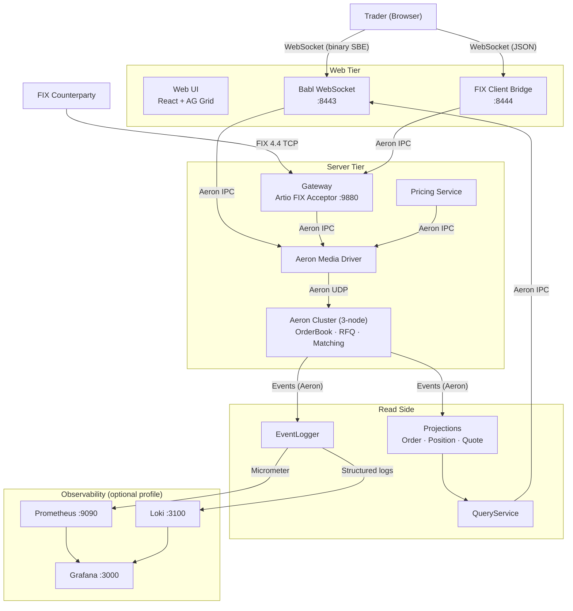
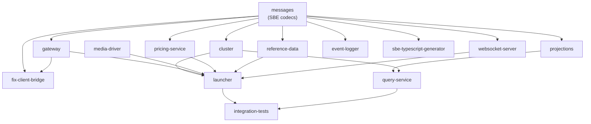

# Architecture

## System Context

Who talks to what, and over which transport.

## Module Dependencies

Build order flows top-to-bottom. No circular dependencies.

## Transport Map

| From | To | Transport | Latency |
|------|----|-----------|---------|
| FIX Client | Gateway | TCP (FIX 4.4) | ~0.5ms |
| Gateway | Cluster | Aeron IPC (shared memory) | ~1-5us |
| Cluster | Cluster (inter-node) | Aeron UDP multicast | ~5-50us |
| Cluster | Projections | Aeron IPC | ~1-5us |
| QueryService | Babl | Aeron IPC | ~1-5us |
| Babl | Browser | WebSocket TCP | ~0.1-1ms |
| FIX Bridge | Browser | WebSocket TCP (JSON) | ~0.1-1ms |
