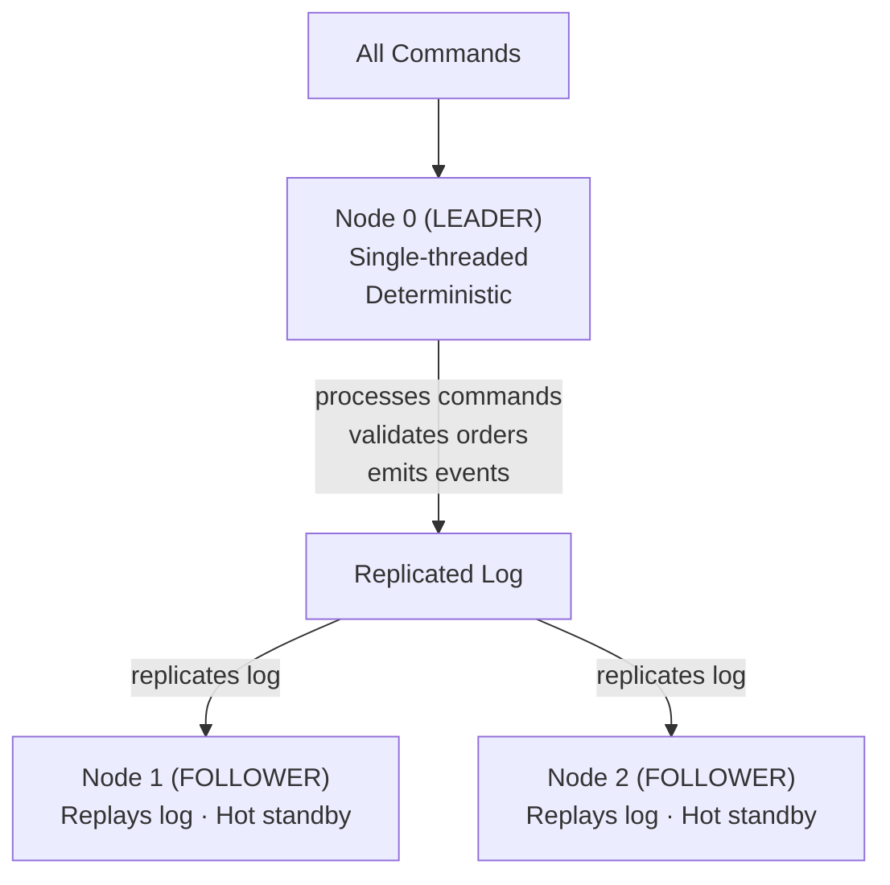
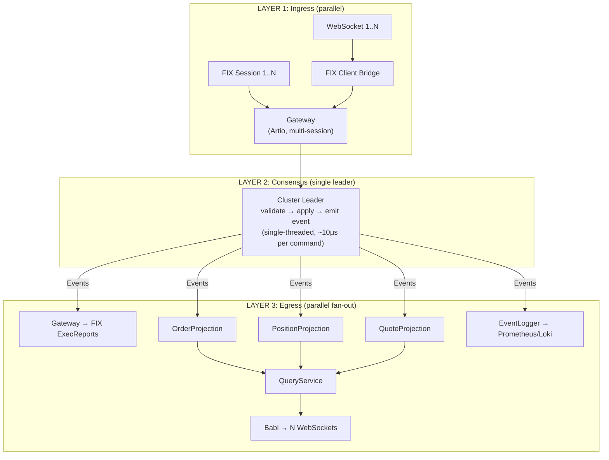
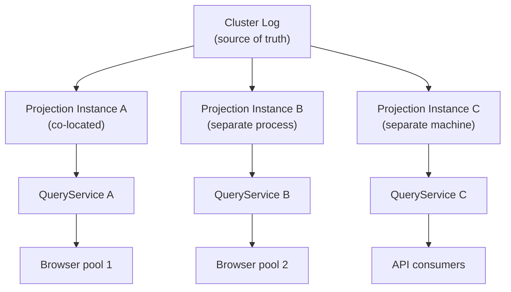

# How Aeron Cluster Works and Distributes Load

## 1. The Core Concept: Leader Does All Writes

Aeron Cluster is **NOT a load balancer**. It's a **consensus system** (Raft-based, 3-node).



**Key insight:** Only 1 node (leader) processes writes at any time. The other 2 are hot standbys that maintain identical state via log replay.

This is intentional — deterministic single-threaded processing is what gives us:
- Sub-10μs command processing latency
- Zero-allocation hot path (flyweight SBE)
- Guaranteed ordering (no locks, no races)
- Exact state replay on any node

---

## 2. Where Load Distribution Actually Happens

Load doesn't split across cluster nodes. Instead, load splits across **architectural layers**:



| Layer | Parallelism | Bottleneck? |
|-------|-------------|-------------|
| Ingress (Gateway, FIX Bridge) | Multi-session, multi-threaded | No — Artio handles thousands of sessions |
| Consensus (Cluster) | **Single-threaded leader** | **Yes — by design** (~100K orders/sec) |
| Egress (Projections, WebSocket) | Parallel fan-out, multi-consumer | No — each projection is independent |

The cluster leader IS the bottleneck, and that's correct. A single thread doing integer-only validation and Agrona map lookups can process ~100K-500K commands/sec. That's more than enough for an FX trading desk.

---

## 3. What Each Node Actually Does

### Leader Node
```
onSessionMessage(clientSession, timestamp, buffer, offset, length):
    1. Decode SBE command (flyweight, zero-alloc)
    2. Route to CommandHandler (PlaceOrder, CancelOrder, QuoteRequest...)
    3. Validate (symbol exists? quantity > 0? no duplicate clOrdId?)
    4. Apply to write model (OrderBook.add(), RfqStateMachine.transition())
    5. Emit event to replicated log (OrderAccepted, OrderRejected...)
    6. Aeron replicates log entry to followers
    7. After majority ack → event committed → published to egress
```

### Follower Nodes
```
onSessionMessage(clientSession, timestamp, buffer, offset, length):
    // Invoked by framework on replicated log replay — same callback, same code path
    1. Decode SBE command (flyweight, zero-alloc)
    2. Route to CommandHandler (PlaceOrder, CancelOrder, QuoteRequest...)
    3. Validate (same checks as leader)
    4. Apply to write model (identical state transitions)
    // Result: state is identical to leader at all times.
    // Ready to become leader instantly if current leader dies.
```

### Why Followers Run the Same Code
- **Determinism verification:** if a follower diverges, it detects the error
- **Instant failover:** no "warm-up" — follower already has current state
- **Snapshot consistency:** any node can take a valid state snapshot

---

## 4. Read-Side Scaling (Where Real Distribution Happens)

The read side is completely decoupled from the write side. This is where you scale:



**Scaling the read side:**
- Add more projection instances (each replays from the same event log)
- Each instance builds its own denormalized views
- No coordination needed between read replicas
- Each can serve different consumer types (browsers, APIs, reporting)

**For our trading engine (current design):**
- 1 projection set co-located with the cluster (sub-millisecond)
- Serves all browsers via Babl WebSocket + QueryService
- Sufficient for ~1000 concurrent browser sessions

**If we needed more:**
- Spin up additional projection + QueryService instances
- Point them at the cluster egress stream
- Load-balance browsers across QueryService instances
- Zero changes to cluster code

---

## 5. Failover = Automatic Leader Re-Election

```
Timeline:
─────────────────────────────────────────────────────────▶

t=0     Node 0 (leader) processing orders normally
t=100   Node 0 crashes
t=150   Node 1 election timeout fires (configurable, ~50-150ms)
t=155   Node 1 sends RequestVote to Node 2
t=160   Node 2 grants vote
t=165   Node 1 becomes new leader
t=170   Gateway ClusterClient reconnects to Node 1
t=175   Next order processed by Node 1

Total disruption: ~75ms (undetectable by human traders)
```

**What's preserved:**
- All committed events (majority-acked before commit)
- All in-flight state (followers had identical state)
- Cluster sequence numbers (no duplicates on retry)

**What's lost:**
- Nothing, if the command was committed (majority ack)
- Uncommitted commands (not yet majority-acked) — client retries

---

## 6. Why 3 Nodes?

| Nodes | Tolerate failures | Quorum | Use case |
|-------|-------------------|--------|----------|
| 1 | 0 | 1 | Dev/testing only |
| 3 | 1 | 2 | **Our choice** — production minimum |
| 5 | 2 | 3 | High availability (rare for trading) |

3 nodes is the sweet spot:
- Survives 1 node failure
- Minimal replication overhead (2 followers)
- Election completes in <100ms

---

## 7. Throughput and Latency Characteristics

### Single Command Latency
```
Component                    Latency
──────────────────────────── ─────────
FIX parse → SBE encode       ~5 μs
Aeron IPC to cluster          ~1-5 μs
Cluster validate + apply     ~10 μs
Log replication (majority)   ~5-50 μs  (depends on network)
Egress to gateway             ~1-5 μs
SBE decode → FIX encode       ~5 μs
──────────────────────────── ─────────
Total (FIX → FIX):           ~30-80 μs  (localhost)
                              ~0.1-1 ms  (network)
```

### Throughput
```
OrderBook lookup (Agrona):     ~50 ns
SBE encode/decode:             ~20 ns
Single command (validate+apply): ~100-500 ns

Theoretical max:  ~2-10M commands/sec (single-threaded)
Practical max:    ~100-500K commands/sec (with replication + egress)
```

For context: a busy FX desk does ~10K-50K orders/day (~1 order/sec average, ~100-500 orders/sec peak burst during volatile markets). Against a practical max of ~100K-500K commands/sec, we have ~1000x headroom on average and ~200-5000x headroom at peak burst.

---

## 8. Summary: Load Distribution Model

```
┌──────────────────────────────────────────────────────────┐
│                                                          │
│  "Load distribution" in Aeron Cluster means:             │
│                                                          │
│  1. WRITES:  One leader, single-threaded, deterministic  │
│              (~100K+ commands/sec, sub-100μs latency)    │
│                                                          │
│  2. READS:   N projection replicas, fully parallel       │
│              (scale horizontally, eventually consistent)  │
│                                                          │
│  3. FAILOVER: Automatic re-election in <100ms            │
│               Zero message loss, zero state loss         │
│                                                          │
│  4. INGRESS: Gateway handles N sessions in parallel      │
│              FIX Client Bridge handles N WebSockets      │
│                                                          │
│  5. EGRESS:  Fan-out to N consumers (projections,        │
│              browsers, loggers) — all independent         │
│                                                          │
│  The cluster is NOT a load balancer.                     │
│  It's a consensus engine with parallelism at the edges.  │
│                                                          │
└──────────────────────────────────────────────────────────┘
```
