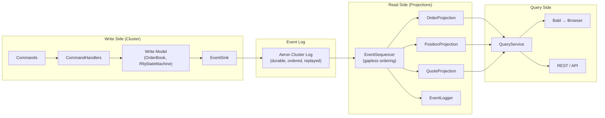
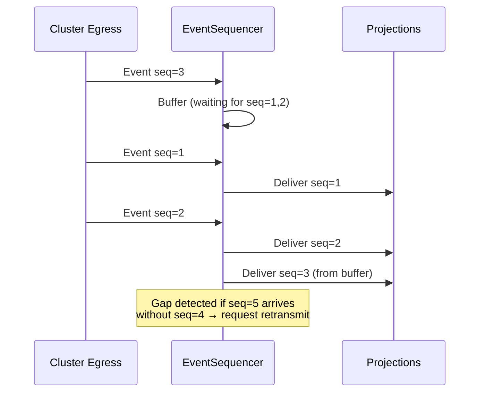

# CQRS + Event Sourcing

## Overview

Command Query Responsibility Segregation separates the write path (commands) from the read path (queries). Combined with event sourcing, events are the single source of truth.



## Why Two Models?

```
                    Write Model                       Read Model
                    ───────────                       ──────────

Purpose             Enforce invariants                Serve queries fast

Data structure      Minimal (OrderBook has            Denormalized, pre-
                    only what validation needs)       aggregated, indexed

Threading           Single-threaded (Aeron            Multi-threaded OK
                    Cluster leader only)

Allocation          Zero-alloc (flyweight SBE,        Can allocate freely
                    Agrona maps)

Consistency         Strong (consensus)                Eventually consistent

Scalability         1 leader (writes)                 N replicas (reads)

Determinism         Required (log replay)             Not required

Example             OrderBook stores:                 OrderProjection stores:
                    - orderId → (price, qty, side)    - clOrdId → full OrderView
                    - nothing else                    - symbol index
                                                      - status index
                                                      - fill history
```

## Event Sourcing: Events as Database

There is no traditional database. The Aeron Cluster log IS the database.

```
┌─────────────────────────────────────────────────────┐
│                 Aeron Cluster Log                    │
│                                                     │
│  Seq 1: OrderAccepted  {clOrdId=001, sym=EURUSD}   │
│  Seq 2: OrderAccepted  {clOrdId=002, sym=GBPUSD}   │
│  Seq 3: QuoteRequested {reqId=R001, sym=EURUSD}     │
│  Seq 4: QuoteCreated   {reqId=R001, bid, ask}       │
│  Seq 5: OrderFilled    {clOrdId=003, fillPx, qty}   │
│  Seq 6: ── SNAPSHOT ── {orderBook state at seq 6}   │
│  Seq 7: OrderCancelled {clOrdId=001}                │
│  ...                                                │
└─────────────────────────────────────────────────────┘
```

### Recovery

```
Node restarts
     │
     ▼
Load latest snapshot (seq 6)         ← write model only (OrderBook, RfqStateMachine,
     │                                  AccountStore, PositionTracker, IdGenerator,
     ▼                                  EventSequencer)
Replay events 7 → latest
     │
     ▼
Write model fully rebuilt            ← deterministic, same state
     │
     ▼
Fast-expire stale RFQs              ← any RFQ with elapsed TTL emits QuoteExpired
     │
     ▼
Projections replay 0 → latest       ← read model rebuilt from Archive (no projection snapshots)
     │
     ▼
Ready to serve
```

**Design decision:** Projections have no snapshots. They always rebuild by replaying all events from Aeron Archive position 0. This means the Archive log must never be truncated. Trade-off: slower projection recovery vs. architectural simplicity and guaranteed correctness.

### Why Not a Database?

| Concern | Event Sourcing | Traditional DB |
|---------|---------------|----------------|
| Audit trail | Free (events ARE the trail) | Separate audit table |
| Replay/debug | Replay to any point in time | Lost unless you log changes |
| Schema migration | Add new projection, replay | ALTER TABLE + backfill |
| Performance | In-memory, sub-microsecond | Network round-trip per query |
| Complexity | Must handle eventual consistency | Familiar CRUD model |

## The EventSequencer

Events from the cluster may arrive out of order or with gaps (network, failover). The EventSequencer guarantees gapless, ordered delivery to projections.



## Projection Interface

```java
public interface Projection {
    // Called for every event, in sequence order
    void onEvent(DirectBuffer buffer, int offset, int length,
                 int templateId, long sequence, long timestamp);

    // Reset state (for replay from scratch)
    void reset();
}
```

All projections implement this interface. The EventSequencer calls `onEvent` for each event in order. Projections decode the SBE message and update their internal state.

**Note:** Projections do not have snapshot methods. They always recover by calling `reset()` followed by replaying all events from Aeron Archive position 0. Write-model snapshots (templates 200-206) are handled by `TradingClusteredService` directly, not via the Projection interface.

## Consistency Model

```
Timeline:
─────────────────────────────────────────────────────▶

Write:    PlaceOrder ──▶ Cluster validates ──▶ OrderAccepted emitted
                                                      │
                                                      │ ~1-5 μs
                                                      ▼
Read:                                          OrderProjection updated
                                                      │
                                                      │ ~1-5 μs
                                                      ▼
Browser:                                       AG Grid row appears

Total write-to-screen: < 1ms on localhost
                        < 5ms over network
```

The read model is **eventually consistent** with the write model, but the gap is microseconds on the same machine. For a trading UI refreshing at 100ms intervals, this is indistinguishable from strong consistency.

## Adding a New Projection

One of the key benefits of CQRS + event sourcing: new read models can be added without touching the write side.

```
1. Implement Projection interface
2. Register with EventSequencer
3. Replay all events from log → projection builds from scratch
4. Start receiving live events
5. Expose via QueryService

No changes to:
- Cluster code
- Command handlers
- Existing projections
- Event schema
```

Example: adding a "TradeHistory" projection for regulatory reporting

```java
public class TradeHistoryProjection implements Projection {
    private final Object2ObjectHashMap<String, List<TradeRecord>> bySymbol;

    void onEvent(...) {
        if (templateId == OrderFilledDecoder.TEMPLATE_ID) {
            // decode and store
        }
        // ignore all other events
    }
}
```

Register it, replay, done. The audit trail was always there — you just weren't reading it yet.

## Projection Recovery Guarantees

Projections are stateless event consumers that rebuild entirely from the Aeron Archive event log:

1. On recovery, each projection calls `reset()` to clear any in-memory state
2. The EventSequencer replays all events from Archive position 0 in sequence order
3. Each projection processes every event via `onEvent()`, rebuilding its read model
4. No coordination between projections is needed — replay is deterministic

**Implications:**

- Aeron Archive log must **never be truncated** — projections depend on full replay
- Adding a new projection is trivial: implement `Projection`, register, replay from 0
- Recovery time is proportional to total event count (not just events since last snapshot)
- For production systems with millions of events, consider the event archival strategy (APP-68) but keep the Archive intact
