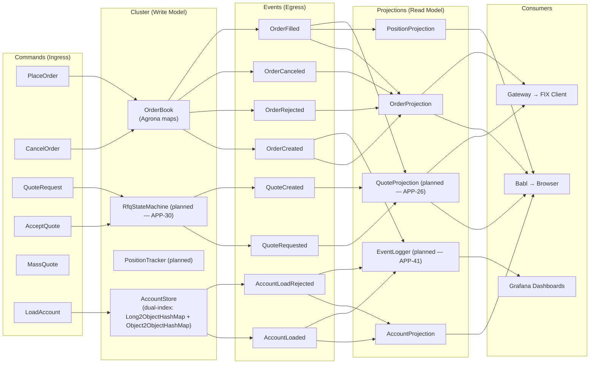

# Event Map

## Command → Event → Projection

This is the contract. SBE schema implements exactly these messages. Every arrow is a test case.

### Commands (Ingress to Cluster)

SBE template IDs 1-10 are reserved for command and response messages.
SBE template IDs 11-19 are reserved for reference data commands.
AcceptQuote is not a separate SBE message — it uses NewOrderSingle with ordType=PreviouslyQuoted and quoteId set.

```text
Command             │ SBE Template ID │ FIX MsgType │ SBE Message                   │ Handler
────────────────────┼─────────────────┼─────────────┼───────────────────────────────┼──────────────────────────
QuoteRequest        │ 1               │ R (QuoteReq)│ QuoteRequest                  │ QuoteRequestHandler (planned — APP-30)
PlaceOrder          │ 4               │ D (NOS)     │ NewOrderSingle                │ NewOrderSingleHandler
AcceptQuote         │ 4               │ D (NOS)     │ NewOrderSingle                │ AcceptQuoteHandler (planned — APP-30)
CancelOrder         │ 6               │ F (Cancel)  │ CancelOrderRequest            │ CancelOrderHandler (planned)
MassQuote           │ 7               │ i (MassQt)  │ MassQuote                     │ MassQuoteHandler (planned)
PlaceMultileg       │ 8               │ AB          │ NewOrderMultileg              │ (planned — APP-46)
CancelMultileg      │ 9               │ AC          │ MultilegOrderCancelReplace    │ (planned — APP-46)
LoadAccount         │ 11              │ —           │ LoadAccount                   │ LoadAccountHandler
LoadAccountBatch    │ 12              │ —           │ LoadAccountBatch              │ LoadAccountBatchHandler
LoadCurrency        │ 13              │ —           │ LoadCurrency                  │ LoadCurrencyHandler
LoadCurrencyBatch   │ 14              │ —           │ LoadCurrencyBatch             │ LoadCurrencyBatchHandler
LoadRiskLimit       │ 15              │ —           │ LoadRiskLimit                 │ LoadRiskLimitHandler
LoadRiskLimitBatch  │ 16              │ —           │ LoadRiskLimitBatch            │ LoadRiskLimitBatchHandler
```

Template IDs 17-19 are reserved for future reference data types (instruments, venues, etc.).

### Responses (Cluster → Gateway, templateId 2-5)

```text
Response            │ SBE Template ID │ FIX MsgType │ SBE Message
────────────────────┼─────────────────┼─────────────┼──────────────────────
Quote               │ 2               │ S (Quote)   │ Quote
QuoteRequestReject  │ 3               │ AG          │ QuoteRequestReject
ExecutionReport     │ 5               │ 8 (ExecRpt) │ ExecutionReport
OrderCancelReject   │ 10              │ 9 (CxlRej)  │ OrderCancelReject
```

### Pricing Messages (Internal, templateId 50-53)

```text
Message                  │ SBE Template ID │ Direction        │ SBE Message
─────────────────────────┼─────────────────┼──────────────────┼──────────────────────
PriceRequest             │ 50              │ Cluster → Pricing│ PriceRequest
PriceResponse            │ 51              │ Pricing → Cluster│ PriceResponse
PriceValidationRequest   │ 52              │ Cluster → Pricing│ PriceValidationRequest
PriceValidationResponse  │ 53              │ Pricing → Cluster│ PriceValidationResponse
```

### Events (Egress from Cluster, templateId 100-119, 200+)

```text
Event                   │ SBE Template ID │ Trigger Command     │ FIX Response
────────────────────────┼─────────────────┼─────────────────────┼──────────────
OrderCreated            │ 100             │ PlaceOrder          │ ExecReport (150=0)
OrderRejected           │ 101             │ PlaceOrder          │ ExecReport (150=8)
OrderFilled             │ 102             │ AcceptQuote / match │ ExecReport (150=F)
OrderCanceled           │ 103             │ CancelOrder         │ ExecReport (150=4)
QuoteRequested          │ 104             │ QuoteRequest        │ (internal)
QuoteCreated            │ 105             │ PriceResponse       │ Quote (35=S)
QuoteRejected           │ 106             │ QuoteRequest        │ QuoteAck (35=b)
QuoteExpired            │ 107             │ timeout             │ QuoteCancel
PriceRequested          │ 108             │ QuoteRequest        │ (to Pricing Svc)
PriceReceived           │ 109             │ PriceResponse       │ (internal)
AccountLoaded           │ 110             │ LoadAccount         │ (internal)
AccountLoadRejected     │ 111             │ LoadAccount         │ (internal)
OrderCancelRejected     │ 112             │ CancelOrder         │ CxlRej (35=9)
CurrencyLoaded          │ 113             │ LoadCurrency        │ (internal)
CurrencyLoadRejected    │ 114             │ LoadCurrency        │ (internal)
RiskLimitLoaded         │ 115             │ LoadRiskLimit       │ (internal)
RiskLimitLoadRejected   │ 116             │ LoadRiskLimit       │ (internal)
SnapshotTaken           │ 200             │ cluster timer       │ (internal)
AccountSnapshot         │ 201             │ snapshot            │ (internal)
OrderBookSnapshot       │ 202             │ snapshot            │ (internal)
RfqStateSnapshot        │ 203             │ snapshot            │ (internal)
PositionSnapshot        │ 204             │ snapshot            │ (internal)
IdGeneratorSnapshot     │ 205             │ snapshot            │ (internal)
EventSequencerSnapshot  │ 206             │ snapshot            │ (internal)
CurrencySnapshot        │ 208             │ snapshot            │ (internal)
RiskLimitSnapshot       │ 209             │ snapshot            │ (internal)
```

Snapshot templates 200-209 are for **write-model state only**. Projections do not use snapshots — they replay all events from Archive position 0 on recovery.

**EventSequencerSnapshot (206) clarification:** The EventSequencer snapshot preserves the *write-side* next-sequence counter so the cluster does not reissue duplicate sequence numbers after restore. Projections ignore this snapshot — they replay all events from Archive position 0, using the sequence numbers already embedded in each event, and rebuild their own position tracking from scratch.

Template IDs 117-119 are reserved for future reference data events.

### Projection Matrix

Which projections consume which events:

```text
Event                │ ID  │ Order │ Position │ Quote (2) │ Account │ EventLogger (3)
─────────────────────┼─────┼───────┼──────────┼───────────┼─────────┼────────────────
OrderCreated         │ 100 │   X   │          │           │         │      X
OrderRejected        │ 101 │   X   │          │           │         │      X
OrderFilled          │ 102 │   X   │    X     │     X     │         │      X
OrderCanceled        │ 103 │   X   │          │           │         │      X
QuoteRequested       │ 104 │       │          │     X     │         │      X
QuoteCreated         │ 105 │       │          │     X     │         │      X
QuoteRejected        │ 106 │       │          │     X     │         │      X
QuoteExpired         │ 107 │       │          │     X     │         │      X
PriceRequested       │ 108 │       │          │           │         │      X
PriceReceived        │ 109 │       │          │           │         │      X
AccountLoaded        │ 110 │       │          │           │    X    │      X
AccountLoadRejected  │ 111 │       │          │           │   (1)   │      X
OrderCancelRejected  │ 112 │       │          │           │         │      X
CurrencyLoaded       │ 113 │       │          │           │         │      X
CurrencyLoadRejected │ 114 │       │          │           │         │      X
RiskLimitLoaded      │ 115 │       │          │           │         │      X
RiskLimitLoadRejected│ 116 │       │          │           │         │      X
```

(1) AccountProjection consumes AccountLoadRejected for observability only (logging rejected account codes and reasons). It does NOT create an account record — any rejection is a fatal startup error that aborts the process before the system becomes operational.
(2) QuoteProjection is planned (APP-26) — not yet implemented.
(3) EventLogger is planned (APP-41) — module exists but has zero Java source files.

**Note:** Snapshot events (200-209) are not listed in the projection matrix. They are consumed exclusively by `TradingClusteredService` for write-model restore, not by read-side projections. `EventLogger` logs snapshot events for observability but does not treat them as projection state.

### Projection Views

```text
OrderProjection
├── getOrder(String orderId)          → OrderSnapshot
├── getOrderByClOrdId(String)         → OrderSnapshot
├── getOrdersByAccount(String)        → List<OrderSnapshot>
├── getOrdersBySymbol(String)         → List<OrderSnapshot>
├── getActiveOrders()                 → List<OrderSnapshot>
├── size()                            → int
└── Fields: orderId, clOrdId, symbol, side, price, quantity, status,
            fillQty, fillPx, account, timestamp

PositionProjection
├── getPosition(String account, String symbol)  → PositionSnapshot
├── getPositionsByAccount(String)               → List<PositionSnapshot>
├── getPositionsBySymbol(String)                → List<PositionSnapshot>
├── getAllPositions()                            → List<PositionSnapshot>
├── size()                                      → int
└── Fields: account, symbol, netQuantity, avgPrice, realizedPnl,
            lastUpdated

QuoteProjection (planned — APP-26, not yet implemented)
├── getByQuoteReqId(String)      → QuoteView
├── getActive()                  → Collection<QuoteView>
├── getBySymbol(String)          → Collection<QuoteView>
└── Fields: quoteReqId, symbol, side, quantity, bidPrice,
            askPrice, state, expiryTime, legs[]

AccountProjection
├── getByAccountId(long)              → AccountReadModel
├── getByAccountCode(String)          → AccountReadModel
├── getAll()                          → List<AccountReadModel>
├── getActiveAccounts()               → List<AccountReadModel>
├── size()                            → int
└── Fields: accountId, accountCode, accountName, accountType,
            baseCurrency, status, maxOrderSize, maxDailyVolume,
            canTrade, canRequestQuotes
```

## Data Flow Diagram



## Fixed-Point Pricing

All prices and quantities use `int64 x 10^-8` (8 decimal places):

```text
Display Price    │ Wire Value (int64)    │ SBE Type
─────────────────┼───────────────────────┼──────────
1.08500000       │ 108500000             │ int64
0.00000001       │ 1                     │ int64
1,000,000.00     │ 100000000000000       │ int64
```

Arithmetic is integer-only in the cluster:
```java
midPrice = (bid + ask) / 2          // integer division
spread   = ask - bid                // integer subtraction
notional = price * quantity / 100_000_000L   // scale correction (integer literal, not floating-point)
```

## Design Notes

### Account Validation: Code-Based Lookup

NewOrderSingleHandler and QuoteRequestHandler (planned — APP-30) validate accounts using the **string account code** from the FIX/SBE message (e.g., "ACME-001"), not the numeric accountId. AccountStore exposes `getByCode(DirectBuffer, offset, length)` for zero-allocation lookup. See [reference-data.md](reference-data.md) for dual-index design.

### CancelOrder: No Account Validation

CancelOrder bypasses account validation by design. Cancellation must always be possible regardless of account status (e.g., if an account is suspended after an order is placed, the trader must still cancel outstanding orders). The `account` field in CancelOrder is for audit trail only.

### maxDailyVolume: Reserved for Future Use

The field exists in the SBE schema and AccountState but is not enforced. It requires timer infrastructure (daily reset) and cumulative volume tracking that does not yet exist.
