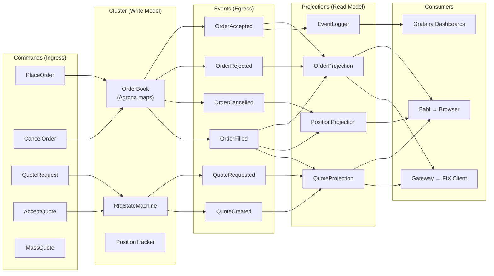

# Event Map

## Command → Event → Projection

This is the contract. SBE schema implements exactly these messages. Every arrow is a test case.

### Commands (Ingress to Cluster)

```
Command             │ SBE Template ID │ FIX MsgType │ Handler
────────────────────┼─────────────────┼─────────────┼──────────────────────
PlaceOrder          │ 1               │ D (NOS)     │ PlaceOrderHandler
CancelOrder         │ 2               │ F (Cancel)  │ CancelOrderHandler
QuoteRequest        │ 3               │ R (QuoteReq)│ QuoteRequestHandler
AcceptQuote         │ 4               │ D (NOS)     │ AcceptQuoteHandler
MassQuote           │ 5               │ i (MassQt)  │ MassQuoteHandler
```

### Events (Egress from Cluster)

```
Event               │ SBE Template ID │ Trigger Command     │ FIX Response
────────────────────┼─────────────────┼─────────────────────┼──────────────
OrderAccepted       │ 101             │ PlaceOrder          │ ExecReport (150=0)
OrderRejected       │ 102             │ PlaceOrder          │ ExecReport (150=8)
OrderCancelled      │ 103             │ CancelOrder         │ ExecReport (150=4)
OrderFilled         │ 104             │ AcceptQuote / match │ ExecReport (150=F)
QuoteRequested      │ 105             │ QuoteRequest        │ (internal)
QuoteCreated        │ 106             │ PriceResponse       │ Quote (35=S)
QuoteRejected       │ 107             │ QuoteRequest        │ QuoteAck (35=b)
QuoteExpired        │ 108             │ timeout             │ QuoteCancel
PriceRequested      │ 109             │ QuoteRequest        │ (to Pricing Svc)
PriceReceived       │ 110             │ PriceResponse       │ (internal)
SnapshotTaken       │ 200             │ cluster timer       │ (internal)
```

### Projection Matrix

Which projections consume which events:

```
Event               │ Order │ Position │ Quote │ EventLogger
────────────────────┼───────┼──────────┼───────┼────────────
OrderAccepted       │  X    │          │       │     X
OrderRejected       │  X    │          │       │     X
OrderCancelled      │  X    │    X     │       │     X
OrderFilled         │  X    │    X     │   X   │     X
QuoteRequested      │       │          │   X   │     X
QuoteCreated        │       │          │   X   │     X
QuoteRejected       │       │          │   X   │     X
QuoteExpired        │       │          │   X   │     X
PriceRequested      │       │          │       │     X
PriceReceived       │       │          │       │     X
SnapshotTaken       │       │          │       │     X
```

### Projection Views

```
OrderProjection
├── getByClOrdId(String)         → OrderView
├── getBySymbol(String)          → Collection<OrderView>
├── getAll()                     → Collection<OrderView>
└── Fields: clOrdId, symbol, side, price, quantity, status,
            fillQty, fillPx, timestamp

PositionProjection
├── getBySymbol(String)          → PositionView
├── getAll()                     → Collection<PositionView>
└── Fields: symbol, netQuantity, avgPrice, realizedPnl,
            openOrderCount, lastUpdated

QuoteProjection
├── getByQuoteReqId(String)      → QuoteView
├── getActive()                  → Collection<QuoteView>
├── getBySymbol(String)          → Collection<QuoteView>
└── Fields: quoteReqId, symbol, side, quantity, bidPrice,
            askPrice, state, expiryTime, legs[]
```

## Data Flow Diagram



## Fixed-Point Pricing

All prices and quantities use `int64 x 10^-8` (8 decimal places):

```
Display Price    │ Wire Value (int64)    │ SBE Type
─────────────────┼───────────────────────┼──────────
1.08500000       │ 108500000             │ int64
0.00000001       │ 1                     │ int64
1,000,000.00     │ 100000000000000       │ int64
```

Arithmetic is integer-only in the cluster:
```
midPrice = (bid + ask) / 2          // integer division
spread   = ask - bid                // integer subtraction
notional = price * quantity / 1e8   // scale correction
```
