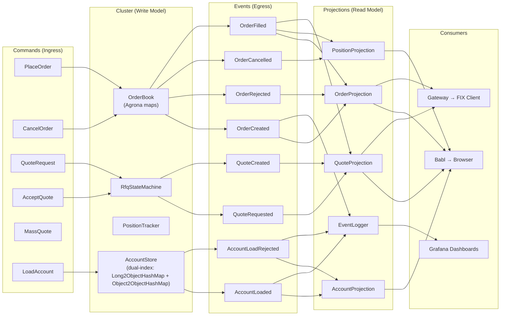

# Event Map

## Command → Event → Projection

This is the contract. SBE schema implements exactly these messages. Every arrow is a test case.

### Commands (Ingress to Cluster)

SBE template IDs 1-10 are reserved for command and response messages.
SBE template IDs 11-19 are reserved for reference data commands.
AcceptQuote is not a separate SBE message — it uses NewOrderSingle with ordType=PreviouslyQuoted and quoteId set.

```
Command             │ SBE Template ID │ FIX MsgType │ SBE Message          │ Handler
────────────────────┼─────────────────┼─────────────┼──────────────────────┼──────────────────────
QuoteRequest        │ 1               │ R (QuoteReq)│ QuoteRequest         │ QuoteRequestHandler
PlaceOrder          │ 4               │ D (NOS)     │ NewOrderSingle       │ PlaceOrderHandler
AcceptQuote         │ 4               │ D (NOS)     │ NewOrderSingle       │ AcceptQuoteHandler
CancelOrder         │ 6               │ F (Cancel)  │ CancelOrderRequest   │ CancelOrderHandler
MassQuote           │ 7               │ i (MassQt)  │ MassQuote            │ MassQuoteHandler
LoadAccount         │ 11              │ —           │ LoadAccount          │ LoadAccountHandler
```

Template IDs 12-19 are reserved for future reference data types (instruments, currency pairs, etc.).

### Responses (Cluster → Gateway, templateId 2-5)

```
Response            │ SBE Template ID │ FIX MsgType │ SBE Message
────────────────────┼─────────────────┼─────────────┼──────────────────────
Quote               │ 2               │ S (Quote)   │ Quote
QuoteRequestReject  │ 3               │ AG          │ QuoteRequestReject
ExecutionReport     │ 5               │ 8 (ExecRpt) │ ExecutionReport
```

### Events (Egress from Cluster, templateId 100-119, 200+)

```
Event               │ SBE Template ID │ Trigger Command     │ FIX Response
────────────────────┼─────────────────┼─────────────────────┼──────────────
OrderCreated        │ 100             │ PlaceOrder          │ ExecReport (150=0)
OrderRejected       │ 101             │ PlaceOrder          │ ExecReport (150=8)
OrderFilled         │ 102             │ AcceptQuote / match │ ExecReport (150=F)
OrderCancelled      │ 103             │ CancelOrder         │ ExecReport (150=4)
QuoteRequested      │ 104             │ QuoteRequest        │ (internal)
QuoteCreated        │ 105             │ PriceResponse       │ Quote (35=S)
QuoteRejected       │ 106             │ QuoteRequest        │ QuoteAck (35=b)
QuoteExpired        │ 107             │ timeout             │ QuoteCancel
PriceRequested      │ 108             │ QuoteRequest        │ (to Pricing Svc)
PriceReceived       │ 109             │ PriceResponse       │ (internal)
AccountLoaded       │ 110             │ LoadAccount         │ (internal)
AccountLoadRejected │ 111             │ LoadAccount         │ (internal)
SnapshotTaken       │ 200             │ cluster timer       │ (internal)
AccountSnapshot     │ 201             │ snapshot            │ (internal)
```

Template IDs 112-119 are reserved for future reference data events.

### Projection Matrix

Which projections consume which events:

```
Event               │ ID  │ Order │ Position │ Quote │ Account │ EventLogger
────────────────────┼─────┼───────┼──────────┼───────┼─────────┼────────────
OrderCreated        │ 100 │  X    │          │       │         │     X
OrderRejected       │ 101 │  X    │          │       │         │     X
OrderFilled         │ 102 │  X    │    X     │   X   │         │     X
OrderCancelled      │ 103 │  X    │    X     │       │         │     X
QuoteRequested      │ 104 │       │          │   X   │         │     X
QuoteCreated        │ 105 │       │          │   X   │         │     X
QuoteRejected       │ 106 │       │          │   X   │         │     X
QuoteExpired        │ 107 │       │          │   X   │         │     X
PriceRequested      │ 108 │       │          │       │         │     X
PriceReceived       │ 109 │       │          │       │         │     X
AccountLoaded       │ 110 │       │          │       │    X    │     X
AccountLoadRejected │ 111 │       │          │       │    X    │     X
SnapshotTaken       │ 200 │       │          │       │         │     X
AccountSnapshot     │ 201 │       │          │       │    X    │     X
```

### Projection Views

```
OrderProjection
├── getByClOrdId(String)         → OrderView
├── getBySymbol(String)          → Collection<OrderView>
├── getAll()                     → Collection<OrderView>
└── Fields: clOrdId, symbol, side, price, quantity, status,
            fillQty, fillPx, timestamp

PositionProjection
├── getBySymbol(String)          → PositionView
├── getAll()                     → Collection<PositionView>
└── Fields: symbol, netQuantity, avgPrice, realizedPnl,
            openOrderCount, lastUpdated

QuoteProjection
├── getByQuoteReqId(String)      → QuoteView
├── getActive()                  → Collection<QuoteView>
├── getBySymbol(String)          → Collection<QuoteView>
└── Fields: quoteReqId, symbol, side, quantity, bidPrice,
            askPrice, state, expiryTime, legs[]

AccountProjection
├── getByAccountId(long)         → AccountView
├── getByAccountCode(String)     → AccountView
├── getAll()                     → Collection<AccountView>
└── Fields: accountId, accountCode, accountName, accountType,
            baseCurrency, status, maxOrderSize, maxDailyVolume,
            canTrade, canRequestQuotes
```

## Data Flow Diagram



## Fixed-Point Pricing

All prices and quantities use `int64 x 10^-8` (8 decimal places):

```
Display Price    │ Wire Value (int64)    │ SBE Type
─────────────────┼───────────────────────┼──────────
1.08500000       │ 108500000             │ int64
0.00000001       │ 1                     │ int64
1,000,000.00     │ 100000000000000       │ int64
```

Arithmetic is integer-only in the cluster:
```
midPrice = (bid + ask) / 2          // integer division
spread   = ask - bid                // integer subtraction
notional = price * quantity / 1e8   // scale correction
```

## Design Notes

### Account Validation: Code-Based Lookup

PlaceOrderHandler and QuoteRequestHandler validate accounts using the **string account code** from the FIX/SBE message (e.g., "ACME-001"), not the numeric accountId. AccountStore exposes `getByCode(DirectBuffer, offset, length)` for zero-allocation lookup. See [reference-data.md](reference-data.md) for dual-index design.

### CancelOrder: No Account Validation

CancelOrder bypasses account validation by design. Cancellation must always be possible regardless of account status (e.g., if an account is suspended after an order is placed, the trader must still cancel outstanding orders). The `account` field in CancelOrder is for audit trail only.

### maxDailyVolume: Reserved for Future Use

The field exists in the SBE schema and AccountState but is not enforced. It requires timer infrastructure (daily reset) and cumulative volume tracking that does not yet exist.
