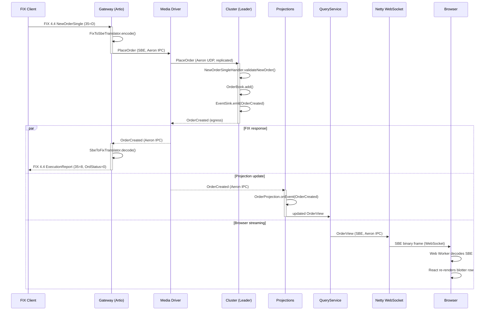
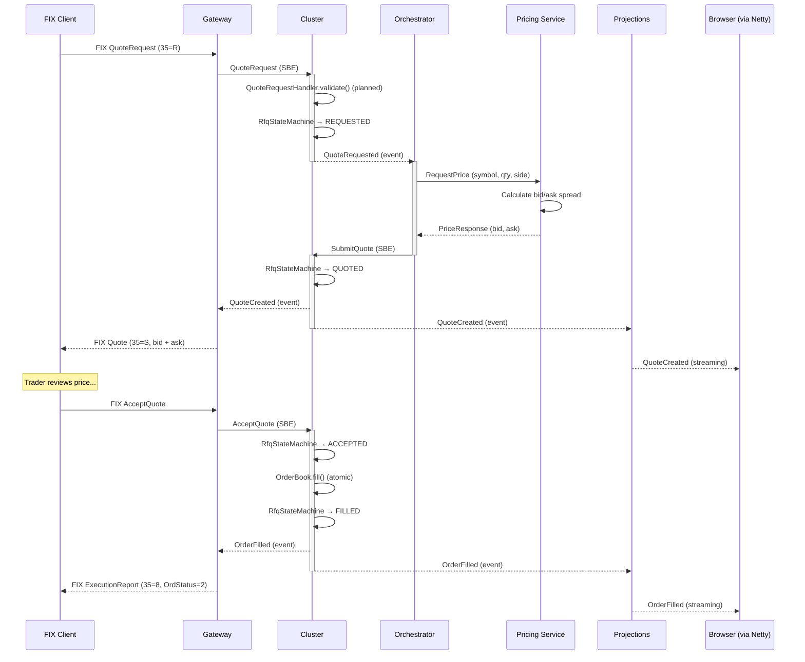
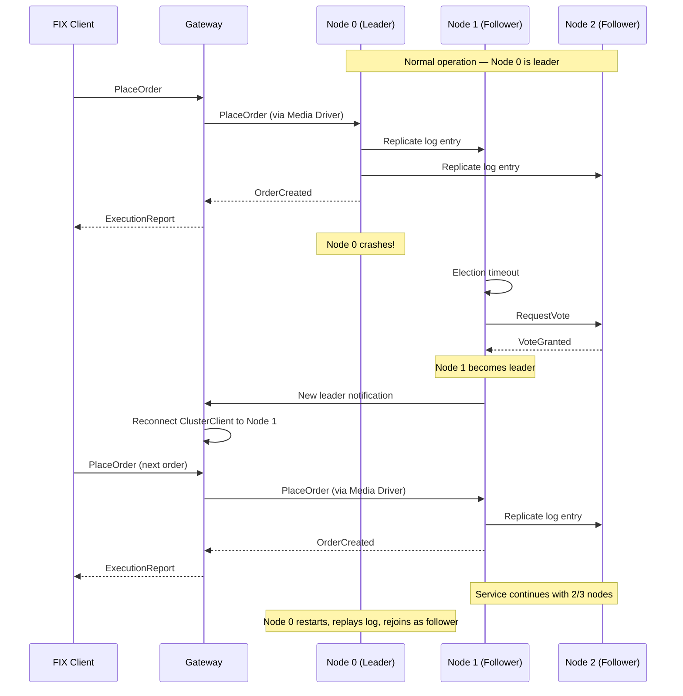
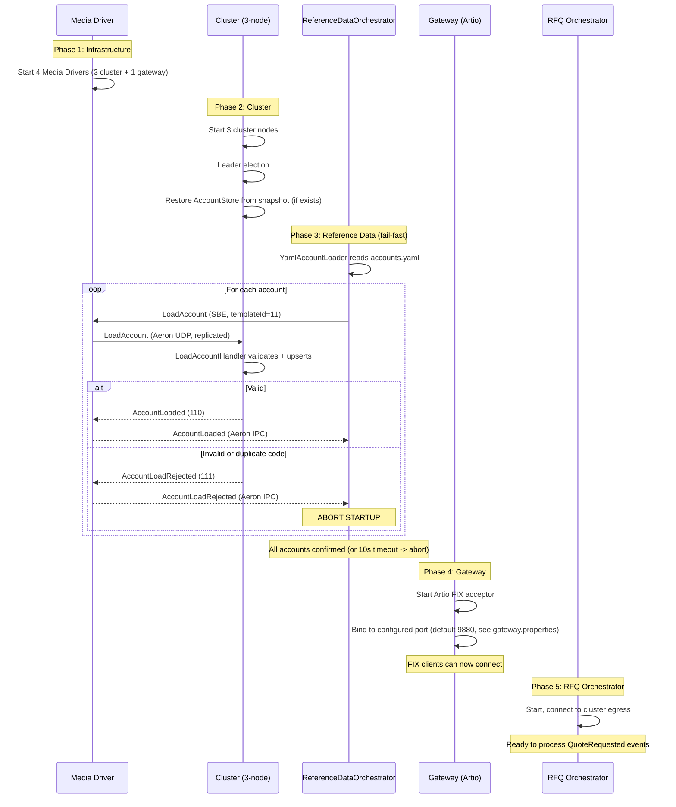

# Sequence Diagrams

## 1. New Order Single (NOS) — Happy Path

The core trading flow: FIX client sends order, cluster validates, executes, and returns execution report.



### Latency Budget

```text
FIX parse + SBE encode:     ~5 us
Aeron IPC to cluster:       ~1-5 us
Cluster validate + apply:  ~10 us
Aeron egress:               ~1-5 us
SBE decode + FIX encode:    ~5 us
TCP to FIX client:          ~0.1 ms
─────────────────────────────────────
Total (FIX-to-FIX):        ~0.15 ms
```

---

## 2. RFQ Full Flow

Request-for-quote: client asks for a price, Pricing Service responds, client accepts, order fills. **(Planned — APP-29, APP-30. QuoteRequestHandler, RfqStateMachine, RFQ Orchestrator, and Pricing Service are not yet implemented.)**



---

## 3. Leader Failover

Node 0 (leader) dies. Cluster elects new leader. No messages lost.



### Failover Guarantees

| Guarantee | Mechanism |
|-----------|-----------|
| No message loss | Aeron log replication (majority ack before commit) |
| No duplicate processing | Cluster sequence numbers (idempotent replay) |
| Automatic reconnect | ClusterClient detects leader change, reconnects |
| State recovery | New leader has full replicated log |
| Rejoining node | Replays log from snapshot + remaining entries |

---

## 4. Startup Sequence — Reference Data Loading

The system enforces a strict startup ordering: the FIX acceptor MUST NOT bind until all reference data is loaded and confirmed by the cluster.



### Startup Invariants

| Invariant | Enforcement |
|-----------|-------------|
| No orders before accounts loaded | Gateway starts AFTER ReferenceDataOrchestrator completes |
| Partial load = no startup | Any AccountLoadRejected or 10s timeout aborts the process |
| Idempotent on bounce | Upsert semantics — re-loading same accounts is safe |
| Snapshot recovery is transparent | Cluster restores from snapshot; orchestrator re-sends (idempotent) |
| Account changes require restart | No hot-reload; restart ReferenceDataOrchestrator to pick up new accounts |
| Projections replay from position 0 | No projection snapshots; Archive log never truncated |
| Stale RFQs expired on recovery | RfqStateMachine checks TTL post-snapshot restore; emits QuoteExpired for elapsed RFQs |
