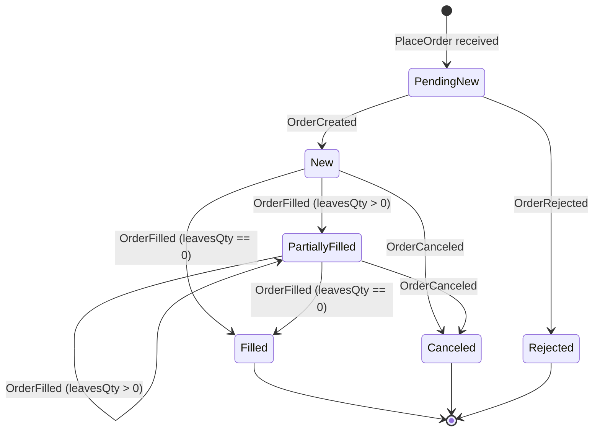
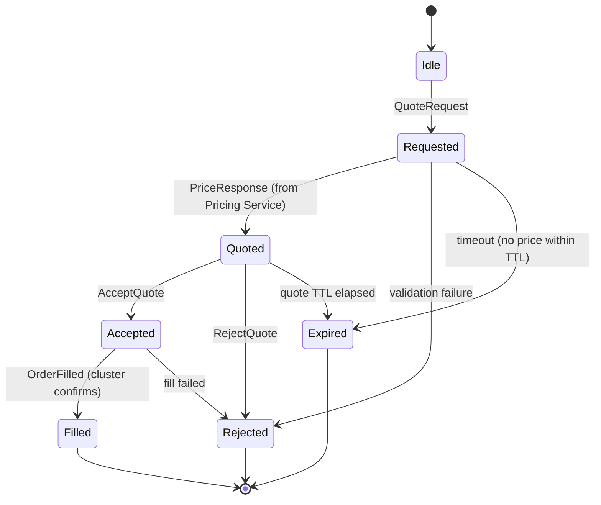
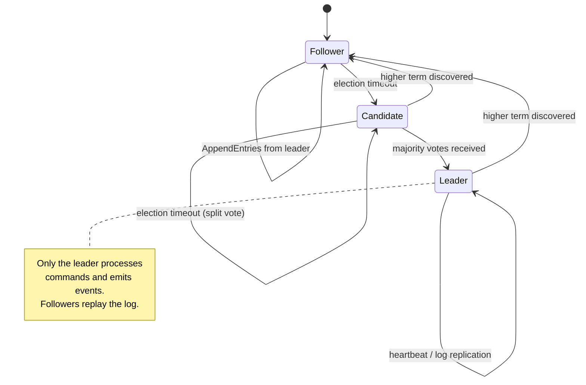

# State Machines

## Order Lifecycle



**Note:** There is no separate `OrderPartiallyFilled` event in the SBE schema. Partial fills use `OrderFilledEvent` (template 102) with `leavesQty > 0`. A full fill is `OrderFilledEvent` with `leavesQty == 0`.

### Rejection Reasons

| Reason | Trigger |
|--------|---------|
| `UNKNOWN_SYMBOL` | Symbol not in OrderBook |
| `INVALID_QUANTITY` | qty <= 0 or not int64 |
| `INVALID_PRICE` | price <= 0 (fixed-point) |
| `DUPLICATE_CLORDID` | clOrdId already exists (APP-206: enforcement pending) |
| `ACCOUNT_NOT_FOUND` | Account code not in AccountStore |
| `ACCOUNT_SUSPENDED` | Account status is not Active |
| `ACCOUNT_NO_TRADE_PERMISSION` | Account lacks CAN_TRADE permission |
| `INVALID_CURRENCY_CODE` | Currency not 3 uppercase ASCII letters |
| `UNKNOWN_CURRENCY` | Currency not in CurrencyStore |
| `ORDER_EXCEEDS_MAX_SIZE` | orderQty exceeds account's maxOrderSize |
| `BOOK_FULL` | OrderBook capacity exceeded |

---

## RFQ Lifecycle



### RFQ Timeouts

| State | Timeout | Action |
|-------|---------|--------|
| Requested | 5s (configurable) | Transition to Expired, notify client |
| Quoted | 30s (configurable) | Transition to Expired, notify client |

### RFQ Recovery on Snapshot Restore

After loading `RfqStateMachine` from `RfqStateSnapshot` (templateId 203), the cluster must handle stale RFQs that may have expired during downtime:

1. Iterate all non-terminal RFQs (REQUESTED, QUOTED states)
2. Compare each RFQ's `expiryTimestamp` against the recovery cluster timestamp
3. **If expired:** emit `QuoteExpired` event, transition to EXPIRED state
4. **If still valid:** re-register timer via `cluster.scheduleTimer(correlationId, expiryTimestamp)`

This prevents zombie quotes from appearing active after recovery. Clients see QuoteExpired events for any quotes that timed out during the outage, rather than stale quotes that silently hang.

### Multi-Leg RFQ (Swap)

Same state machine, but the `QuoteRequest` contains a `NoLegs` repeating group (near leg + far leg). The Pricing Service prices both legs and the cluster fills both atomically.

```
QuoteRequest (Swap)
├── Leg 1: EUR/USD Spot  T+2    1,000,000
└── Leg 2: EUR/USD Fwd   1M     1,000,000 (opposite side)

QuoteCreated (Swap)
├── Leg 1: bid=1.08500000  ask=1.08520000
└── Leg 2: bid=1.08650000  ask=1.08670000
     swap points = fwd - spot = 15.0 / 15.0 pips

AcceptQuote → fills BOTH legs atomically
```

---

## Cluster Consensus



This is handled by Aeron Cluster (Raft-based) — we don't implement consensus, but we must understand it for failover testing (APP-18).
