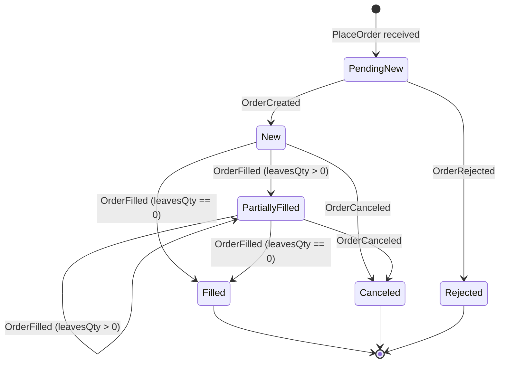
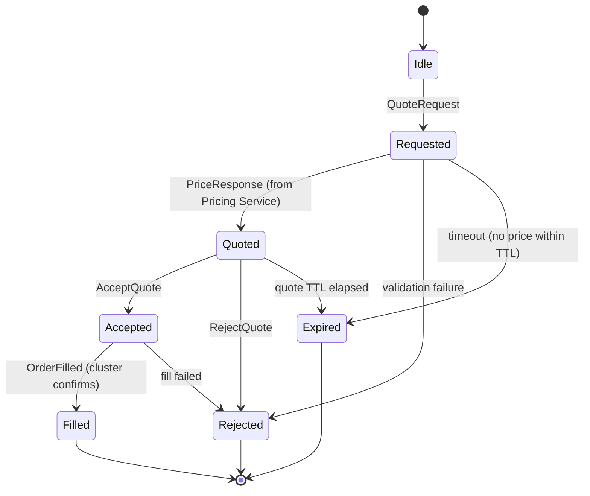
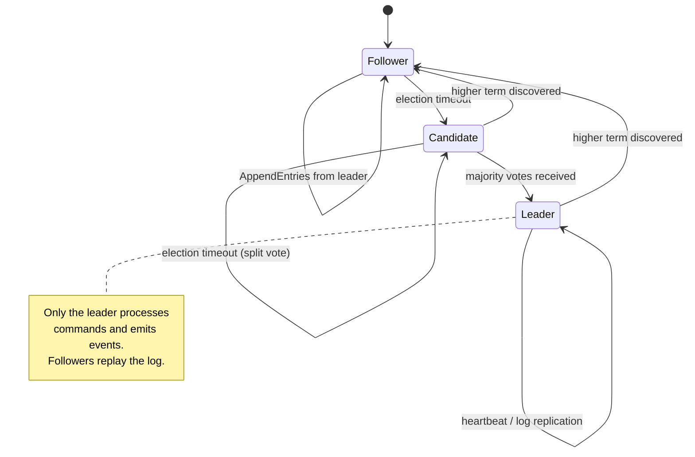

# State Machines

## Order Lifecycle



**Note:** There is no separate `OrderPartiallyFilled` event in the SBE schema. Partial fills use `OrderFilledEvent` (template 102) with `leavesQty > 0`. A full fill is `OrderFilledEvent` with `leavesQty == 0`.

### Rejection Reasons

| Reason                        | Trigger                                               |
| ----------------------------- | ----------------------------------------------------- |
| `UNKNOWN_SYMBOL`              | Symbol not in OrderBook                               |
| `INVALID_QUANTITY`            | qty <= 0 or not int64                                 |
| `INVALID_PRICE`               | price <= 0 (fixed-point)                              |
| `DUPLICATE_CLORDID`           | clOrdId already exists (APP-206: enforcement pending) |
| `ACCOUNT_NOT_FOUND`           | Account code not in AccountStore                      |
| `ACCOUNT_SUSPENDED`           | Account status is not Active                          |
| `ACCOUNT_NO_TRADE_PERMISSION` | Account lacks CAN_TRADE permission                    |
| `INVALID_CURRENCY_CODE`       | Currency not 3 uppercase ASCII letters                |
| `UNKNOWN_CURRENCY`            | Currency not in CurrencyStore                         |
| `ORDER_EXCEEDS_MAX_SIZE`      | orderQty exceeds account's maxOrderSize               |
| `BOOK_FULL`                   | OrderBook capacity exceeded                           |

---

## RFQ Lifecycle



### RFQ Timeouts

| State     | Timeout            | Action                               |
| --------- | ------------------ | ------------------------------------ |
| Requested | 5s (configurable)  | Transition to Expired, notify client |
| Quoted    | 30s (configurable) | Transition to Expired, notify client |

### RFQ Recovery on Snapshot Restore

After loading `RfqStateMachine` from `RfqStateSnapshot` (templateId 203), the cluster must handle stale RFQs that may have expired during downtime:

1. Iterate all non-terminal RFQs (REQUESTED, QUOTED states)
2. Compare each RFQ's `expiryTimestamp` against the recovery cluster timestamp
3. **If expired:** emit `QuoteExpired` event, transition to EXPIRED state
4. **If still valid:** re-register timer via `cluster.scheduleTimer(correlationId, expiryTimestamp)`

This prevents zombie quotes from appearing active after recovery. Clients see QuoteExpired events for any quotes that timed out during the outage, rather than stale quotes that silently hang.

### Multi-Leg RFQ (Swap)

Same state machine, but the `QuoteRequest` contains a `NoLegs` repeating group (near leg + far leg). The Pricing Service prices both legs and the cluster fills both atomically.

```
QuoteRequest (Swap)
├── Leg 1: EUR/USD Spot  T+2    1,000,000
└── Leg 2: EUR/USD Fwd   1M     1,000,000 (opposite side)

QuoteCreated (Swap)
├── Leg 1: bid=1.08500000  ask=1.08520000
└── Leg 2: bid=1.08650000  ask=1.08670000
     swap points = fwd - spot = 15.0 / 15.0 pips

AcceptQuote → fills BOTH legs atomically
```

---

## Cluster Consensus



This is handled by Aeron Cluster (Raft-based) — we don't implement consensus, but we must understand it for failover testing (APP-18).

---

## APP-62 Pre-Trade Risk Engine — validation chain

`NewOrderSingleHandler.validateNewOrder` (see `cluster/src/main/java/com/trading/engine/cluster/handler/NewOrderSingleHandler.java`) runs the checks below in this exact order. The ordering is load-bearing: every peek-only check (no state mutation) runs BEFORE every mutating check (rate-limiter token-bucket, daily-volume counter) so that a rejected order cannot consume a legitimate caller's rate-token or daily-volume capacity. This is the §G DoS-mitigation contract from APP-62 plan §6 R10 HIGH.

| #       | Check                                                 | Trigger                                                                                                                     | Reject reason (`RejectReasonEnum`) | FIX tag 103                                                                                                           |
| ------- | ----------------------------------------------------- | --------------------------------------------------------------------------------------------------------------------------- | ---------------------------------- | --------------------------------------------------------------------------------------------------------------------- | ----------------------- | --- |
| 0       | Trading halt                                          | `tradingState.isTradingHalted()`                                                                                            | `TradingHalted`                    | 3                                                                                                                     |
| 0a      | Risk limits not loaded (§E fail-closed)               | account has no `RiskLimitRecord`                                                                                            | `RiskLimitsNotLoaded`              | 3                                                                                                                     |
| 1       | Empty symbol                                          | `symbolLen == 0`                                                                                                            | `UnknownSymbol`                    | 1                                                                                                                     |
| 2       | Non-positive quantity                                 | `orderQty <= 0`                                                                                                             | `InvalidQuantity`                  | 99                                                                                                                    |
| 3       | Limit price <= 0                                      | `ordType == Limit && price <= 0`                                                                                            | `InvalidPrice`                     | 99                                                                                                                    |
| 4       | Empty account code                                    | `accountCodeLen == 0`                                                                                                       | `AccountNotFound`                  | 3                                                                                                                     |
| 5       | Unknown account                                       | account not in `AccountStore`                                                                                               | `AccountNotFound`                  | 3                                                                                                                     |
| 6       | Suspended account                                     | `status != Active`                                                                                                          | `AccountSuspended`                 | 99                                                                                                                    |
| 7       | No trade permission                                   | `!account.canTrade()`                                                                                                       | `AccountNoTradePermission`         | 99                                                                                                                    |
| 8       | Invalid currency code                                 | not 3 uppercase ASCII                                                                                                       | `InvalidCurrencyCode`              | 99                                                                                                                    |
| 9       | Unknown currency                                      | not in `CurrencyStore`                                                                                                      | `UnknownCurrency`                  | 99                                                                                                                    |
| 10      | PreviouslyQuoted peek (RFQ slot, side, price/qty bps) | slot mismatch                                                                                                               | `QuoteNotFound`                    | 99                                                                                                                    |
| 11      | `orderQty > maxOrderSize`                             | per-account size cap                                                                                                        | `OrderExceedsMaxSize`              | 3                                                                                                                     |
| 11b     | `notional > maxOrderNotional`                         | per-account notional cap (Limit only)                                                                                       | `OrderExceedsMaxSize`              | 3                                                                                                                     |
| 12      | Order-book pool exhausted                             | `tradingState.isOrderBookFull()`                                                                                            | `BookFull`                         | 99                                                                                                                    |
| 12a     | Per-session order cap                                 | `sessionOrders.get(sid).size() >= SESSION_ORDERS_HARD_CAP` (APP-151)                                                        | `BookFull`                         | 99                                                                                                                    |
| **11e** | **Position limit (§4)**                               | projected working long/short would exceed `maxLongPosition` / `maxShortPosition` (CME PTRM Long-Qty / Short-Qty convention) | `PositionLimitExceeded`            | 3                                                                                                                     |
| **11f** | **Fat-finger (§5, §I per-symbol override)**           | `                                                                                                                           | price - lastMid                    | × 10000 / lastMid > effectivePriceDeviationBps`; missing/stale reference fails closed when `fatFingerFailClosed=true` | `PriceTooFarFromMarket` | 99  |
| **11g** | **Symbol eligibility (§G — fail-closed)**             | no eligibility record, or `tradingAllowed=0`, or Sell against `shortSaleAllowed=0`                                          | `RegulatoryRestriction`            | 99                                                                                                                    |
| 11c     | Rate limit (token-bucket — MUTATES)                   | per-account rate budget exhausted                                                                                           | `OrderExceedsMaxSize`              | 3                                                                                                                     |
| 11d     | Daily volume (MUTATES)                                | running daily volume + `orderQty > maxDailyVolume`                                                                          | `OrderExceedsMaxSize`              | 3                                                                                                                     |

**Ordering invariant**: checks 11e, 11f, 11g run AFTER 11/11b/12/12a (cheaper / pre-validation gates) but BEFORE 11c/11d (the mutating gates). 11e and 11f are peek-only — the working-position counter is incremented later in `admitNewOrder::applyWorkingPosition`, and `lastQuotedMidPrice` / `lastQuotedMidAsOfNanos` are only mutated by the cluster's `PriceResponse` handler (`updateLastQuotedMid`), never by `validateNewOrder`. 11g reads `symbolEligibilityStore` exclusively — single map probe shared with 11f via the hoisted `symbolEligibility` local (R11 LOW Agent A #5).

**Single packed-symbol-key hoist**: `packSymbolKey(symbolScratch, 0)` is computed once and reused for the §4 working-position lookups, the §5 last-mid lookup, and the §G eligibility lookup (R10 LOW Agent A #8). Eliminates two redundant `Object2ObjectHashMap` probes per limit order on the hot path.

**FIX wire mapping**: see `SbeToFixTranslator::mapRejectReason`. `PositionLimitExceeded` and `RiskLimitsNotLoaded` map to FIX `OrdRejReason=3` (Order exceeds limit); `PriceTooFarFromMarket`, `RegulatoryRestriction`, and `FourEyesViolation` map to FIX `OrdRejReason=99` (Other) because FIX 4.4 has no dedicated reason code for fat-finger, restricted-symbol, or dual-control breaches. The structured `RiskCheckEnum` plus `limitValue` / `projectedValue` fields on `OrderRejectedEvent` carry the breach context to projections; the gateway also stamps a stable `[POSITION_LIMIT] / [FAT_FINGER] / [RISK_LIMITS_NOT_LOADED] / [SYMBOL_ELIGIBILITY] / [FOUR_EYES]` prefix into FIX tag 58 (Text) for ops triage.

### §J OrderExpiredEvent — terminal state from idle-session expiry

When a session times out (`per-account idleSessionTimeoutNanos`, §B), the cluster sweeps the session's working orders and emits `OrderExpiredEvent` (template 121) for each. This translates to FIX `35=8, ExecType=C` (Expired) on the wire — the gateway distinguishes idle-timeout expiry from time-in-force expiry via the `expiryCause` discriminator on the event. Order lifecycle gains an `Expired` terminal state alongside `Canceled` / `Filled` / `Rejected`.
