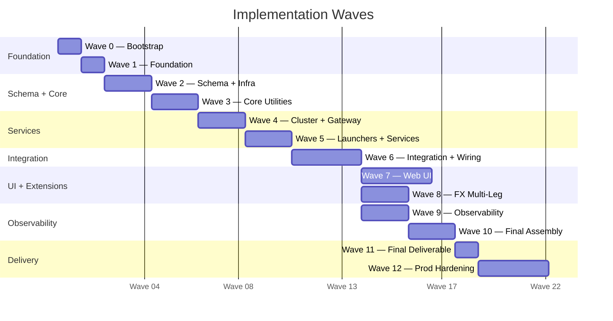
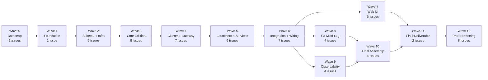

# Wave Plan

13 waves, 66 issues (APP-5 – APP-70). Each wave gates the next via dependency order. See `AGENTS.md` for agent roles, prompts, and conflict resolution.

## Timeline

## Wave Summary

### Wave 0 — Bootstrap (3 issues)

Project scaffolding, CI, and documentation before any code.

| Issue  | Title |
|--------|-------|
| APP-55 | Project documentation — architecture, CQRS, sequences, state machines, deployment |
| APP-56 | Project bootstrap — CI, branch protection, CLAUDE.md, git config |
| APP-57 | Reference data documentation and wave plan summary |

---

### Wave 1 — Foundation (1 issue)

Everything depends on this.

| Issue | Title |
|-------|-------|
| APP-5 | Scaffold Gradle multi-module project with JDK 25 and CLAUDE.md |

---

### Wave 2 — Schema + Infrastructure (6 issues)

SBE message schema and Aeron media driver. Schema issues are serial (shared `trading-schema.xml`): APP-6 → APP-19 → APP-28 → APP-44 → APP-70. APP-17 is independent.

| Issue  | Title |
|--------|-------|
| APP-6  | SBE XML schema — QuoteRequest, Quote, NOS, ExecReport, CancelOrder, MassQuote |
| APP-17 | Standalone Aeron Media Driver module |
| APP-19 | Domain event SBE message types and EventType/RejectReason enums |
| APP-28 | Pricing SBE messages — PriceRequest, PriceResponse, PriceValidation |
| APP-44 | FX product types, settlement fields, NoLegs repeating group |
| APP-70 | Reference data SBE messages — LoadAccount, AccountLoaded, AccountSnapshot |

---

### Wave 3 — Core Utilities (8 issues)

Domain logic building blocks: ID generation, order book, translators, event sourcing primitives, account store.

| Issue  | Title |
|--------|-------|
| APP-7  | Deterministic IdGenerator and OrderBook |
| APP-10 | FixToSbeTranslator and SbeToFixTranslator |
| APP-11 | Unit tests for FIX-SBE translators |
| APP-20 | EventSequencer — monotonic sequence numbers + snapshot support |
| APP-21 | EventJournal — bounded in-memory event store with replay |
| APP-24 | Projections module — Projection interface and EventConsumer |
| APP-58 | AccountStore + LoadAccountHandler in cluster |
| APP-59 | reference-data module — generic framework + YAML/CSV loaders |

---

### Wave 4 — Cluster Service + Gateway (7 issues)

Core cluster service, gateway client, and projections.

| Issue  | Title |
|--------|-------|
| APP-8  | TradingClusteredService — NOS → ExecutionReport |
| APP-9  | Unit tests for TradingClusteredService |
| APP-12 | ClusterClient + ClusterEgressListener |
| APP-13 | FixGateway + FixSessionHandler with Artio |
| APP-14 | ClusterNodeLauncher (3-node) with external Media Driver |
| APP-25 | OrderProjection + PositionProjection read models |
| APP-60 | AccountProjection + account validation in order/quote handlers |

---

### Wave 5 — Launchers + Services (6 issues)

Top-level launchers, pricing service, orchestrator, FIX client bridge.

| Issue  | Title |
|--------|-------|
| APP-15 | GatewayLauncher + TradingEngineLauncher |
| APP-22 | Refactor to CommandHandler/EventSink pattern with event sourcing |
| APP-26 | QuoteProjection + unified QueryService API |
| APP-29 | Pricing Service — dummy price generation + Aeron IPC |
| APP-30 | Orchestrator module — RFQ state machine + Aeron IPC wiring |
| APP-39 | FIX Client Bridge — Artio initiator with WebSocket JSON API |

---

### Wave 6 — Integration Tests + Wiring (7 issues)

End-to-end wiring and integration test suite.

| Issue  | Title |
|--------|-------|
| APP-16 | Integration: FIX NOS → 3-node Cluster → ExecutionReport |
| APP-18 | Integration: Leader failover — order processing continues |
| APP-23 | Integration: gapless event sequencing and replay across failover |
| APP-31 | Wire Gateway → Orchestrator → Pricing → Cluster |
| APP-32 | Unit tests: Pricing, Orchestrator, RFQ state machine |
| APP-33 | Integration: full RFQ → Quote → NOS → ExecutionReport via Orchestrator |
| APP-61 | Integration: load accounts from YAML/CSV, validate on order |

---

### Wave 7 — Web UI (6 issues)

Browser-based trading UI: SBE TypeScript codegen, WebSocket, React blotters.

| Issue  | Title |
|--------|-------|
| APP-34 | SBE TypeScript code generator |
| APP-35 | Babl WebSocket server with Aeron IPC passthrough |
| APP-36 | Web Worker + WebSocket client + SBE decoding + RxJS plumbing |
| APP-37 | React 19 streaming blotter with AG Grid |
| APP-40 | RFQ trading panel + FIX message log |
| APP-42 | Event Log viewer panel |

---

### Wave 8 — FX Multi-Leg Extensions (4 issues)

Extend translators, handlers, orchestrator, and projections for multi-leg FX.

| Issue  | Title |
|--------|-------|
| APP-45 | Update FIX-SBE translators for FX product types |
| APP-46 | Update CommandHandlers for multi-leg validation and swap flow |
| APP-47 | Update Orchestrator RFQ state machine for multi-product |
| APP-48 | Update projections for multi-leg order and quote events |

---

### Wave 9 — Observability (4 issues)

Structured logging, metrics, and Aeron telemetry.

| Issue  | Title |
|--------|-------|
| APP-41 | EventLogger — structured event logging with gap detection |
| APP-49 | Micrometer metrics on EventLogger + Prometheus endpoint |
| APP-50 | Loki log shipping for event history queries |
| APP-51 | AeronMetricsAgent — Aeron counter and JVM metric export |

---

### Wave 10 — Final Assembly (4 issues)

Integration validation and Docker observability stack.

| Issue  | Title |
|--------|-------|
| APP-27 | Integration: CQRS read models eventually consistent with write side |
| APP-43 | Integration: EventLogger captures all domain events gapless |
| APP-52 | Docker Compose observability stack with Grafana dashboards |
| APP-53 | Full-Stack Dev Launcher (`./gradlew devAll`) |

---

### Wave 11 — Final Deliverable (2 issues)

Full-stack Docker Compose and E2E WebSocket streaming test.

| Issue  | Title |
|--------|-------|
| APP-38 | Integration: E2E WebSocket streaming from cluster to browser |
| APP-54 | Docker Compose full stack with UI and observability |

---

### Wave 12 — Production Hardening (8 issues)

Risk controls, FIX session lifecycle, benchmarks, and operational tooling.

| Issue  | Title |
|--------|-------|
| APP-62 | Pre-trade risk engine — size limits, position limits, throttling, kill switch |
| APP-63 | FIX session lifecycle — Logon/Logout/Heartbeat/ResendRequest/SequenceReset |
| APP-64 | Instrument reference data — InstrumentStore with symbol, tick size, lot size |
| APP-65 | OrderCancelReplaceRequest (35=G) — order modify support |
| APP-66 | Graceful shutdown — drain in-flight orders, persist state, close FIX sessions |
| APP-67 | JMH microbenchmarks — order matching, SBE encode/decode, FIX translation |
| APP-68 | Event archival — persist event log for EOD reconciliation and audit |
| APP-69 | Drop-copy FIX session — trade reporting and audit trail |

---

## Critical Path

## Issue Count

| Wave | Name | Issues |
|------|------|-------:|
| 0 | Bootstrap | 3 |
| 1 | Foundation | 1 |
| 2 | Schema + Infrastructure | 6 |
| 3 | Core Utilities | 8 |
| 4 | Cluster Service + Gateway | 7 |
| 5 | Launchers + Services | 6 |
| 6 | Integration Tests + Wiring | 7 |
| 7 | Web UI | 6 |
| 8 | FX Multi-Leg Extensions | 4 |
| 9 | Observability | 4 |
| 10 | Final Assembly | 4 |
| 11 | Final Deliverable | 2 |
| 12 | Production Hardening | 8 |
| | **Total** | **66** |
