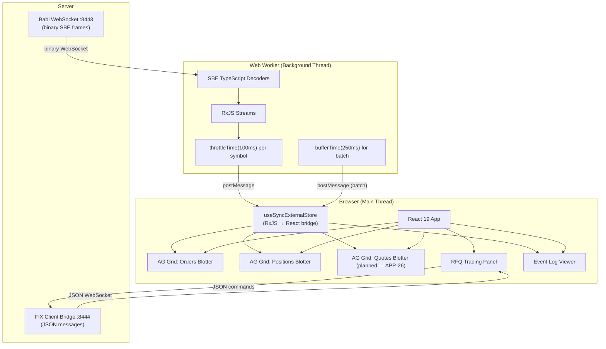

# Web UI Architecture

## Component Map



## Data Flow: Price Update

```
Babl sends binary SBE frame
         │
         ▼
┌─── Web Worker ─────────────────────────────────┐
│                                                 │
│  1. Decode SBE:  QuoteCreatedEventDecoder (1)    │
│     symbol: "EUR/USD"                           │
│     bid: 108500000 (int64)                      │
│     ask: 108520000 (int64)                      │
│                                                 │
│  2. Convert to display:                         │
│     bid: "1.08500000"                           │
│     ask: "1.08520000"                           │
│     spread: "2.0 pips"                          │
│                                                 │
│  3. RxJS subject$.next(priceUpdate)             │
│                                                 │
│  4. throttleTime(100ms) per symbol              │
│     (drop stale ticks, keep latest)             │
│                                                 │
│  5. postMessage({ type: 'price', data })        │
│                                                 │
└─────────────────────┬───────────────────────────┘
(1) Provisional — QuoteCreatedEvent (105) is the closest existing SBE
    message with bid/ask fields. A dedicated streaming price event may
    be added when PricingService (APP-29) is implemented.
                      │
                      ▼
┌─── Main Thread ─────────────────────────────────┐
│                                                  │
│  6. useSyncExternalStore subscribes              │
│                                                  │
│  7. AG Grid applyTransactionAsync({             │
│       update: [{ symbol: "EUR/USD",              │
│                  bid: "1.08500000", ... }]        │
│     })                                           │
│                                                  │
│  8. Cell flash animation on changed values       │
│                                                  │
└──────────────────────────────────────────────────┘
```

## Panel Layout

```
┌──────────────────────────────────────────────────────────────┐
│  Trading Engine                                    [dark]    │
├────────────────────────────────┬─────────────────────────────┤
│                                │                             │
│  Orders Blotter (AG Grid)      │  RFQ Trading Panel          │
│  ┌──────┬──────┬──────┬─────┐  │  ┌───────────────────────┐  │
│  │ClOrd │Symbol│ Side │Price│  │  │ Symbol: [EUR/USD  ▼]  │  │
│  │──────┼──────┼──────┼─────│  │  │ Product:[Spot     ▼]  │  │
│  │001   │EURUSD│ BUY  │1.085│  │  │ Qty:   [1,000,000  ]  │  │
│  │002   │GBPUSD│ SELL │1.265│  │  │ Side:  [BUY] [SELL]   │  │
│  │003   │USDJPY│ BUY  │149.2│  │  │                       │  │
│  └──────┴──────┴──────┴─────┘  │  │ [Request Quote]       │  │
│                                │  │                       │  │
├────────────────────────────────┤  │  Bid: 1.08500000      │  │
│                                │  │  Ask: 1.08520000      │  │
│  Positions Blotter (AG Grid)   │  │  Spread: 2.0 pips     │  │
│  ┌──────┬──────┬──────┬─────┐  │  │                       │  │
│  │Symbol│NetQty│AvgPx │ PnL │  │  │ [Accept Bid] [Lift]   │  │
│  │──────┼──────┼──────┼─────│  │  └───────────────────────┘  │
│  │EURUSD│+1.0M │1.084 │+1.2k│  │                             │
│  │GBPUSD│-500k │1.266 │-350 │  ├─────────────────────────────┤
│  └──────┴──────┴──────┴─────┘  │                             │
│                                │  Event Log Viewer            │
├────────────────────────────────┤  ┌───┬───────┬────────────┐ │
│                                │  │Seq│ Type  │ Details    │ │
│  Quotes Blotter (AG Grid)      │  │───┼───────┼────────────│ │
│  ┌──────┬──────┬──────┬─────┐  │  │001│OrdAcc │EURUSD BUY │ │
│  │ReqId │Symbol│State │Bid  │  │  │002│QtReq  │GBPUSD RFQ │ │
│  │──────┼──────┼──────┼─────│  │  │003│QtCrt  │bid/ask    │ │
│  │R001  │EURUSD│QUOTED│1.085│  │  │004│OrdFil │EURUSD 1M  │ │
│  │R002  │GBPUSD│FILLED│1.264│  │  └───┴───────┴────────────┘ │
│  └──────┴──────┴──────┴─────┘  │                             │
│                                │  [Filter ▼] [Auto-scroll ✓] │
└────────────────────────────────┴─────────────────────────────┘
```

## Issue Map

| Panel | Issue | Key Tech |
|-------|-------|----------|
| SBE TypeScript decoders | APP-34 | Code generator reads SBE XML, outputs TS decoders |
| Babl WebSocket server | APP-35 | Aeron-native, zero-copy SBE passthrough |
| Web Worker + RxJS | APP-36 | Worker thread decodes, throttles, postMessages to main |
| AG Grid blotters | APP-37 | applyTransactionAsync, getRowId, cell flash |
| Event Log viewer | APP-42 | Virtual scrolling, type filter, auto-scroll toggle |
| RFQ trading panel | APP-40 | JSON WebSocket to FIX Bridge, state-driven UI |
